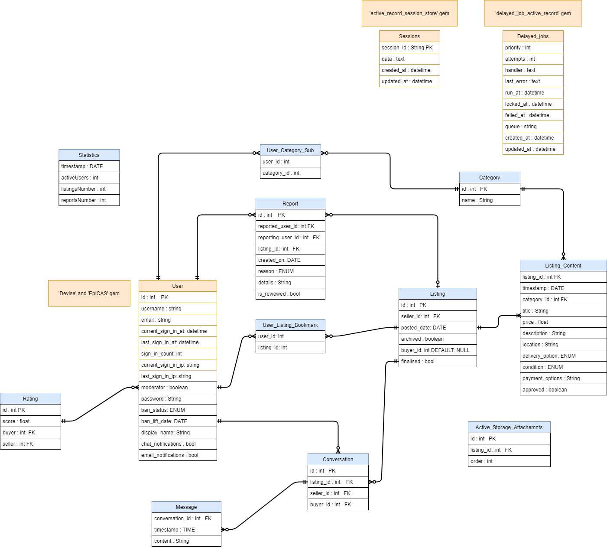

# Software Hut Project - Team 17
---

## Overview

### Description

This rails server is built for The University of Sheffield to act as an internal marketplace for staff and students to advertise products they would like to sell.

### System Features

1. Only students and staff members of the University of Sheffield can log into the system.
2. When a user wants to delete their data or leaves The University of Sheffield, all the information about them is deleted from the site.
3. Any user can create a listing consisting of a title, description, price, photos, condition, location, delivery options, payment options and an associated category.
4. Newly created listings are not available to other users until a site moderator has approved them.
5. All users can edit or delete their own listings.
6. Any edited listings have to be approved by a site moderator before they can be applied. 
7. Site moderators can remove or edit any listing published on the site.
8. Moderators can temporarily suspend users and retract suspensions when required.
9. All users can view any active listings on the site and view all details related to that listing.
10. All users can contact a seller from their profile page and can view all their ongoing conversations.
11. All users can view a list of featured listings (eg: newest listing, free listings, swappable listings).
12. All users can view information about the current site policies and related COVID-19 guidance.
13. All current guidance can be edited by the site moderators as required.
14. Users can view their own and other user's profiles, detailing their name, rating and active listings.
15. All moderators can perform the same functions as a normal user.
16. Listings can be searched for by keywords or filtered by category, location, price, payemnt options or delivery options.
17. Categories can be added or removed by site moderators.
18. Moderators can search for a specific user
19. Moderator priveleges can be given or revoked by another moderator
20. Moderators can send out messages to all site users
21. All users can see if a listing has an edit currently waiting approval

### Directory Structure

All models are stored in the 'app/models' directory.
All assets (images, javascripts, styling documents) are stored in the 'app/assets' directory.
All controllers are stored in the 'app/controllers' directory.
All views are stored in the 'app/views' directory, with views for different models in the relevant subdirectory (eg: Listing views in 'listings' subdirectory).
All seeds are stored in the 'db/seeds' directory.
All unit, integration and request tests are stored in their respective subdirectories in the 'spec' directory.

NB: All paths are relative to the root diectory

### Listing and Listing Content System

- All users can create a listing to publish to the site.
- Each listing has a number of associated listing contents which act as different versions of the listing.
- Images uploaded to a listing are associated with the relevant listing content not the listing itself.
- When a listing is created, a new listing content is created, representing the first version.
- Only the latest approved version (listing content) of the listing is shown on the site.
- When a listing is edited, a new listing content is created for the listing containing any changed and unchanged details.
- When a listing is deleted, all previous listing contents are deleted except for one. This last content is updated to have title, description and location redacted and all images removed from it.

### Database Design

### Team

- Samuel Kent | [email](mailto:aca19sak@sheffield.ac.uk)
- Kamil Topolewski | [email](mailto:ktopolewski1@sheffield.ac.uk)
- Mohaned Al-Bassam | [email](mailto:mal-bassam1@sheffield.ac.uk)
- Michal Jarmocik | [email](mailto:mjarmocik1@sheffield.ac.uk)
- Ngai C Chui | [email](mailto:ncchui1@sheffield.ac.uk)
- Toby JC Wride | [email](mailto:tjcwride1@sheffield.ac.uk)

## Development setup

Use Ubuntu version 18 for development.

Make sure you have the following installed:

- Ruby version 2.6.6
- Bundler version 2.2.15
- Node version 15.12.0
- postgresql server.

Add the file `database.yml` inside the `config/` folder. Use the templates to assist in configuration.

Run the following:

- `bundle install`
- `bundle exec rails db:prepare`
- `bundle exec rails s`

### Testing

Prerequisites:

Chromium web driver as we use it for the js testing environment. This can be installed using `sudo apt-get install chromium-chromedriver`

Run `rails spec` to run all tests.

## Deployment
Deploying to one of the servers (QA, Demo or Production) can be done using the `epi_deploy` gem. 

### Demo Server

Clean working tree, push all commits and make sure you are on the master branch.

#### Automatic deploy

Run `rails deploy:demo_auto` to automatically deploy the server.

#### Manual Steps

Run `rails deploy:demo` to deploy to the server.

Run `rails deploy:demo_seed` to seed the server database with sample data for testing.

### Customer Contact
There is no support, good luck! :)
